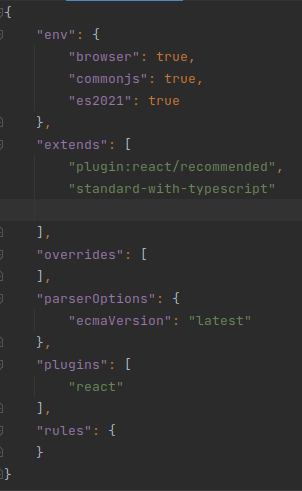
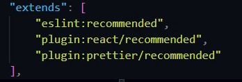
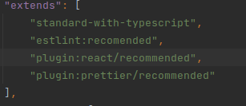

# Setup ESLINT and PRETTIER in React app
Let's get to know what's  ESLINT and PRETTIER

## What is ESLint?
**[ESLint](https://eslint.org/)** Our code is statically analyzed to identify issues. The majority of editors have it. Since ESLint repairs take syntax into account, you won't encounter the issues that are brought on by conventional find-and-replace algorithms.

Along with the built-in rules of ESLint, create your own rules. ESLint may be tailored to function exactly as you need it to for your project.

## What is Prettier?
**[Prettier](https://prettier.io/)** is a partisan code formatter that works with the majority of languages. It helps you save lots of time. Our code is immediately indented upon saving (depending on VSCode/editor settings).

## Why use ESLint and Prettier
Having a robust set-up of automated and manual tools is crucial when developing apps since it ensures the highest standards and code quality. For each project to meet these requirements, a linting tool is required. Each tool has a different linting role between programming and stylistic issues, making it simple to spot errors. Both tools are tunable and they operate well together.

## Setting up Prettier & ESLint
1. In your root folder, open terminal and install eslint as a dev dependency. Additionally, we must activate the prettier and eslint extensions for VSCode. In order to install Eslint and Prettier — Code formatter, go to the extension's area of VSCode (ctrl + shift + x) and search for  [`Eslint`](https://marketplace.visualstudio.com/items?itemName=dbaeumer.vscode-eslint) and [`Prettier — Code formatter`](https://marketplace.visualstudio.com/items?itemName=esbenp.prettier-vscode).
   `npm install eslint --save-dev 
    or 
   yarn add eslint --dev`
2. After that, we'll use the terminal to create our `.eslintrc.json` file, so run this command to create your eslint configuration file. 

    `npx eslint --init 
      or
    yarn run eslint --init`

This will present numerous options, so first choose `To check syntax and find problems`, then choose `JavaScript modules (import/export)`, and then choose `React`. 
It will then ask, `Does your project use TypeScript No/Yes`, and in our case, select `Yes`. 
Select `Browser`, followed by `JSON`. It will then ask you if you want to install **eslint-plugin-react**, so select `yes`.

Your `.eslintrc.json` file will appear as shown.
    

In React 17.0.1, and It’s currently the latest version of React, importing react to a file is optional. 
So our eslint is giving an error that "React" must be in scope when using JSX.
We'll solve this by adding a rule to our `.eslintrc` file. So, under the rules, open your `.eslintrc` file and add the line "react/react-in-jsx-scope": "off."
    `"rules": {
    "react/react-in-jsx-scope": "off"
    }`

3. Run the below command to install the required plugins for the prettier setup
   `npm install eslint-config-prettier eslint-plugin-prettier prettier --save-dev 
   or 
   yarn add eslint-config-prettier eslint-plugin-prettier prettier --dev`

4. It's time to update our `.eslintrc.json` file with some better configuration after installing the aforementioned modules. Therefore, include this line inside extends: `"plugin:prettier/recommended"`
    
    

5. Now, open your App.js file as well as insert few spaces, The eslint tool will indicate several errors. To resolve this, hover your mouse over the faults and press `Ctrl+`, then select `fix all auto-fixable problems`. This will immediately resolve all nicer linting difficulties. 
6. Now we must adjust our VSCode settings to allow prettier to function with autosave. To configure your VScode settings, follow the procedures outlined below.
    - Go to File > Preferences> Settings
    - On the right, there is an icon that says `Open Settings in JSON format`. Select that icon.
    - Add below JSON code there
      `"editor.codeActionsOnSave": { "source.fixAll.eslint": true },
      "editor.formatOnSave": true,
      "eslint.alwaysShowStatus": true,
      "files.autoSave": "onFocusChange"`

VSCode will now automatically correct the format of your code anytime you save it or change the focus from it.

`Note: VScode can also be configured locally. All you need to do is create a **.vscode** directory within your root project, then create a file called **settings.json** inside that directory, then place the above JSON code as an object { } inside that file.`

Here's the complete code for the **.eslintrc.json** file.

            `{
                "env": {
                    "browser": true,
                    "es2021": true,
                    "jest": true
                },
                    "extends": [
                    "eslint:recommended",
                    "plugin:react/recommended",
                    "plugin:prettier/recommended"
                ],
                    "parserOptions": {
                    "ecmaFeatures": {
                    "jsx": true
                },
                    "ecmaVersion": 12,
                    "sourceType": "module"
                },
                    "plugins": [
                    "react"
                ],
                    "rules": {
                    "react/react-in-jsx-scope": "off"
                }
            }`

## References 
Please kindly check respective git repositories.
* [eslint-config-prettier](//Turns%20off%20all%20rules%20that%20are%20unnecessary%20or%20might%20conflict%20with%20Prettier.)
* [eslint-plugin-prettier](https://github.com/prettier/eslint-plugin-prettier) - Runs Prettier as an ESLint rule  
    
